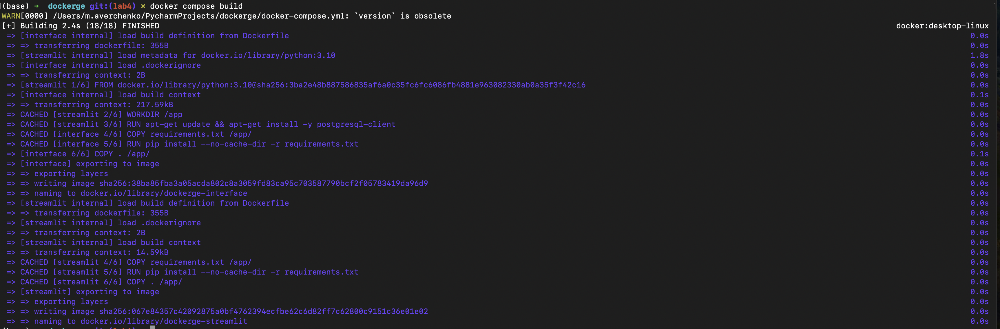
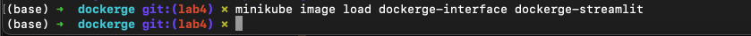
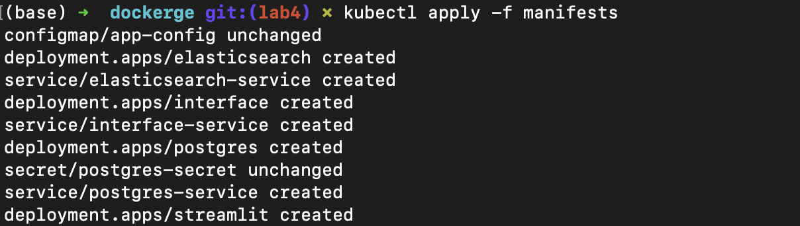
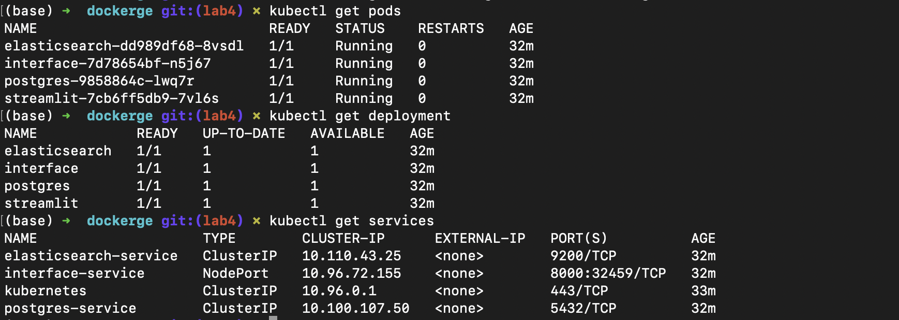
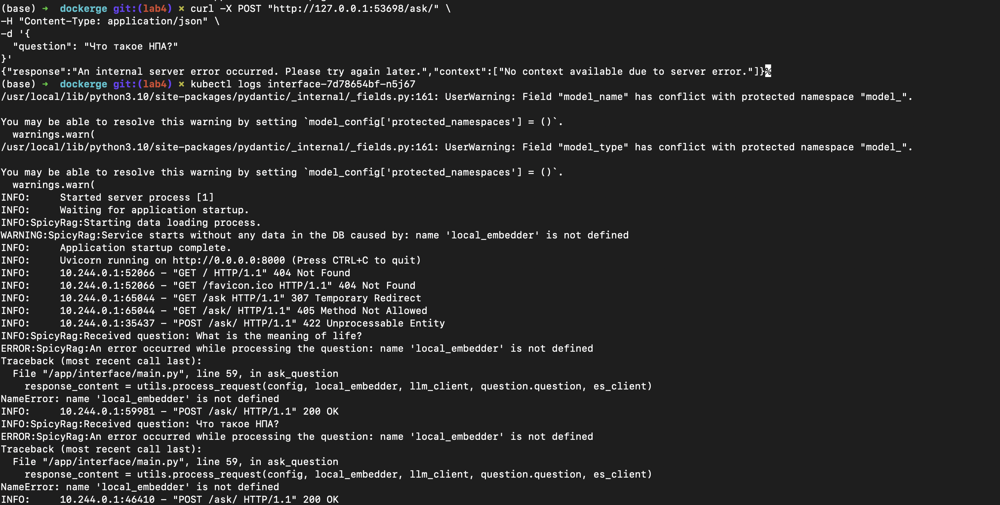
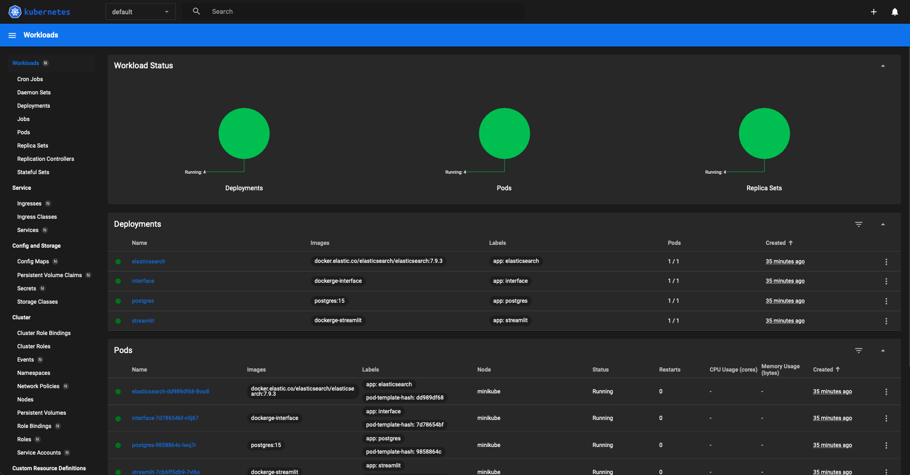

# Лаба 4

Сборка образов 
```bash
docker compose build
```


Добавление образов в minikube
```bash
minikube image load dockerge-interface dockerge-streamlit
```


Применение манифестов 
```bash
kubectl apply -f manifests
```


Проверка, что запустилось
```bash
kubectl get pods
kubectl get deployment
kubectl get services
```


Проверка подключения к сервису
```bash
minikube service interface-service
curl -X POST "http://127.0.0.1:53698/ask/" \
-H "Content-Type: application/json" \
-d '{
  "question": "Что такое НПА?"
}'
```

Вообщем-то вывод правильный, потому что эмбедер и прочее не загружены, так и должно быть, это мок)


Дашборд minikube
```bash
minikube dashboard --url
```

