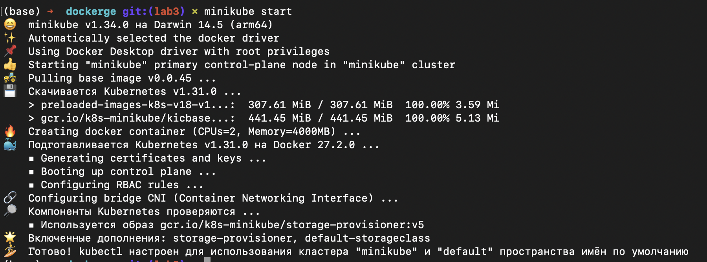
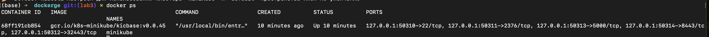
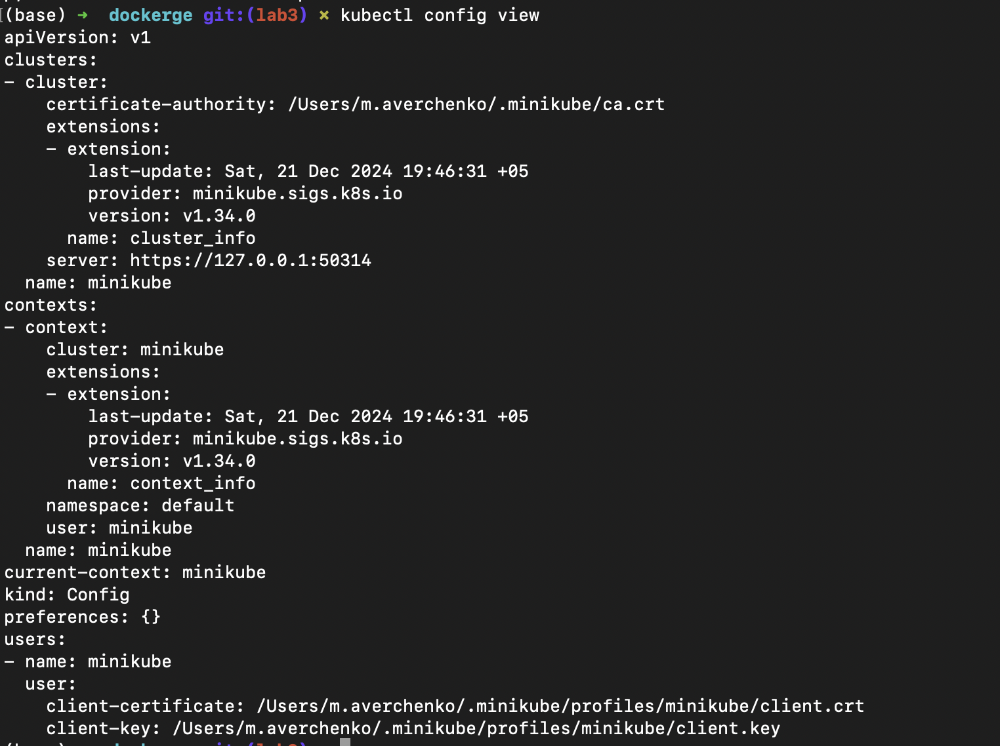
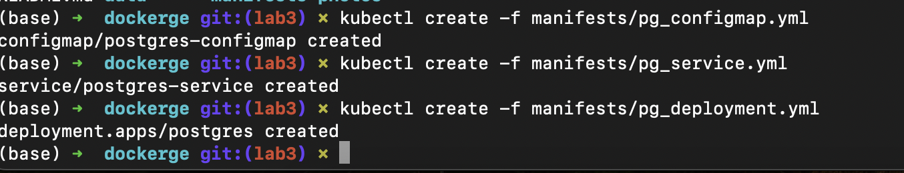
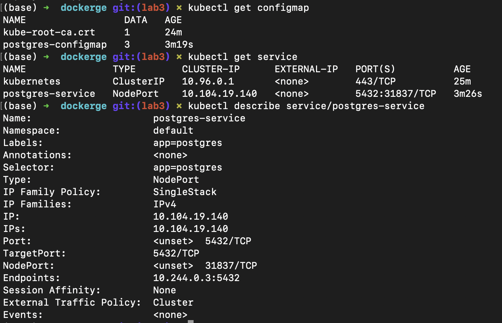
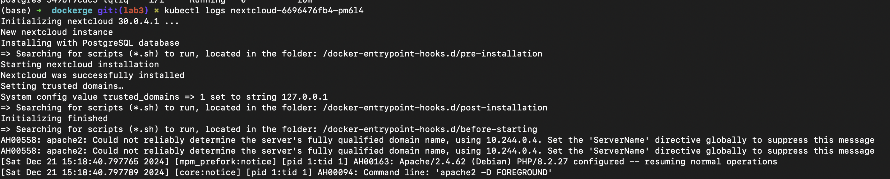
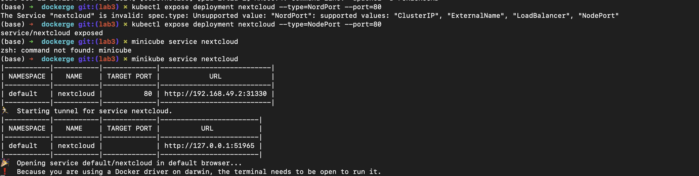
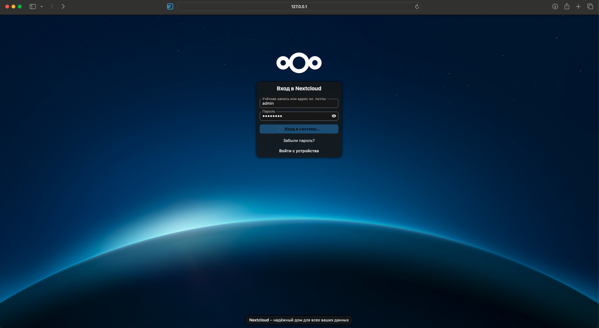
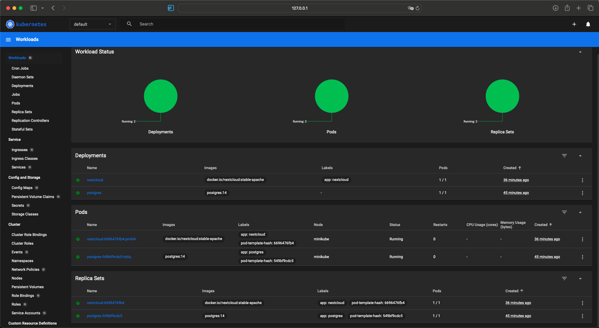

# Лаба 3

### Запуск minikube и проверка, что все правильно установилось, файлов конфигурации




### Применение манифестов


### Проверка применения манифестов


### Запуск nextcloud




### Nextcloud login page 


### Minikube dash


### Вопрос: важен ли порядок выполнения этих манифестов? Почему?
Да, порядок выполнения манифестов важен, потому что некоторые ресурсы зависят от других. Например: \
	*	ConfigMaps и Secrets должны быть созданы перед ресурсами, которые их используют (например, Deployments или Pods). Иначе, если Deployment пытается обратиться к несуществующему ConfigMap или Secret, он не сможет запуститься. \
	*	Services могут быть созданы после ConfigMaps и Secrets, но до использования этих сервисов другими компонентами (например, если сервис используется как POSTGRES_HOST). \
	*	Deployments или Pods должны быть последними, так как они зависят от всех вышеуказанных ресурсов. \

### Вопрос: что (и почему) произойдет, если отскейлить количество реплик postgres-deployment в 0, затем обратно в 1, после чего попробовать снова зайти на Nextcloud? 
Если отскейлить Postgres в 0, то postgres остановится,
nextcloud потеряет коннект к постгресу.
Но вернув обратно в 1 кол-во реплик,
nextcloud не сможет обратно подключиться к postgres и будет отдавать Internal server Error, 
видимо после обрыва коннекта не пытается переподключиться вновь.

Скейлим кол-во реплик `postgres-deployment` в 0, а за тем в 1
```bash
kubectl scale deployment postgres --replicas=0
sleep 10
kubectl scale deployment postgres --replicas=1
```
При попытке подключения к nextloud увидим 
```bash
Internal Server Error

The server encountered an internal error and was unable to complete your request.
Please contact the server administrator if this error reappears multiple times, please include the technical details below in your report.
More details can be found in the server log.
```
По всей видимости, nextcloud потерял соединение с postgres, когда кол-во реплик было 0, подключился, когда кол-во реплик стало 1. Но в конфигурации postgres не прописан volume, поэтому все данные удалены, чтоы и видно по логам постгреса:
```bash
2024-12-29 20:51:13.736 UTC [516] FATAL:  password authentication failed for user "oc_admin"
2024-12-29 20:51:13.736 UTC [516] DETAIL:  Role "oc_admin" does not exist.
        Connection matched pg_hba.conf line 100: "host all all all scram-sha-256"
```
Чтобы восстановить nextcloud, необходимо его также удалить, и заного создать, чтобы он пересоздал снова базу данных.

