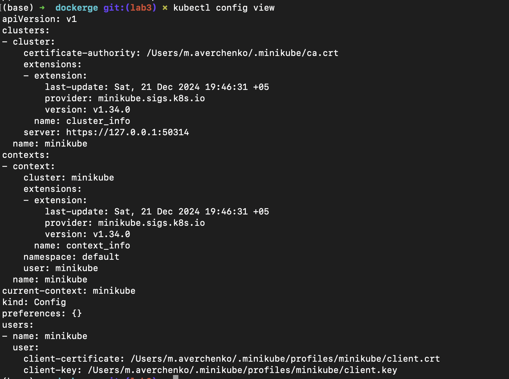
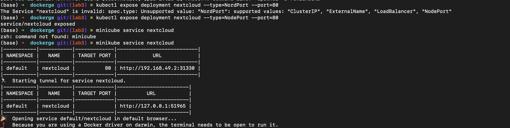

# Лаба 3

### Запуск minikube и проверка, что все правильно установилось, файлов конфигурации

### Применение манифестов

### Проверка применения манифестов

### Запуск nextcloud

### Nextcloud login page 

### Minikube dash

### Вопрос: важен ли порядок выполнения этих манифестов? Почему?
Да, порядок выполнения манифестов важен, потому что некоторые ресурсы зависят от других. Например:
	1.	ConfigMaps и Secrets должны быть созданы перед ресурсами, которые их используют (например, Deployments или Pods). Иначе, если Deployment пытается обратиться к несуществующему ConfigMap или Secret, он не сможет запуститься.
	2.	Services могут быть созданы после ConfigMaps и Secrets, но до использования этих сервисов другими компонентами (например, если сервис используется как POSTGRES_HOST).
	3.	Deployments или Pods должны быть последними, так как они зависят от всех вышеуказанных ресурсов.

### Вопрос: что (и почему) произойдет, если отскейлить количество реплик postgres-deployment в 0, затем обратно в 1, после чего попробовать снова зайти на Nextcloud? 
Если отскейлить Postgres в 0, то postgres остановится, nextcloud потеряет коннект к постгресу. Но вернув обратно в 1 кол-во реплик, nextcloud не сможет обратно подключиться к postgres и будет отдавать Internal server Error, видимо после обрыва коннекта не пытается переподключиться вновь.

